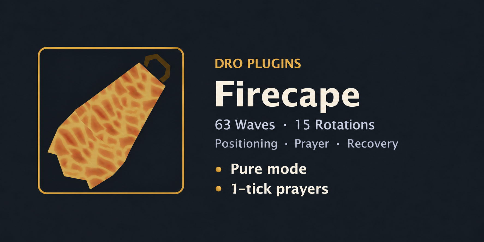
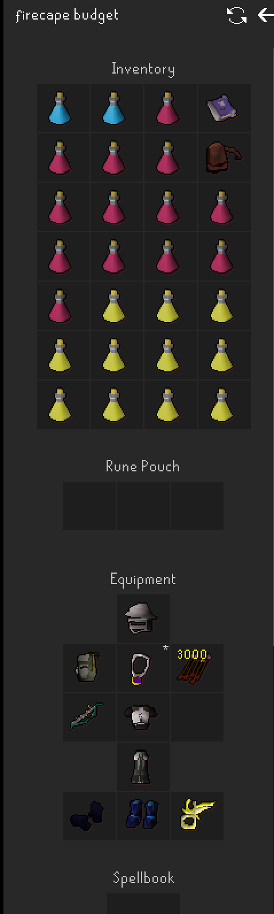
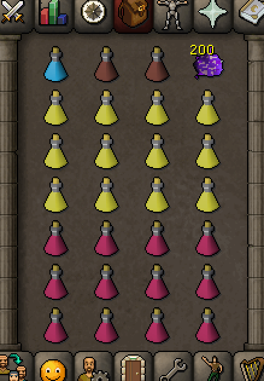
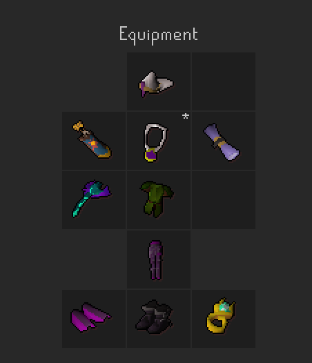
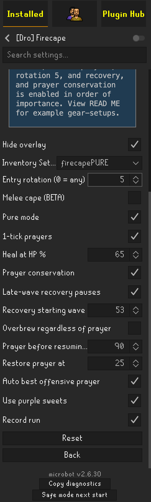

# [Dro] Firecape

**Free and open source.** DRO provides this plugin without a purchase, subscription or paid license key. Original DRO contributions use the [BSD 2-Clause license](https://opensource.org/license/bsd-2-clause). Redistributed source and binaries must retain the DRO copyright, license conditions and disclaimer; existing third-party notices also remain applicable.

Automated Fight Caves for Microbot: all **63 waves and 15 rotations**, TzHaar travel, banking, equipment, positioning, protection prayers, potions and supported thralls. Version **0.3.71**, requiring **Microbot 2.6.30**.

**There is no guarantee of a Fire cape. Better gear and adequate supplies improve the chances. Test under supervision.** Normal ranged mode has completed capes; Pure has substantial live testing but no confirmed completed cape in the retained evidence. Melee remains untested.

## Quick start

1. Create and select an **Inventory Setup** with your intended equipment and supplies. Stock the matching items in the bank and check ammunition, weapon charges and spell prerequisites.
2. Choose the controller and settings below. Fresh startup requires at least 43 base Prayer, a recognized weapon and immediate prayer-restoration supplies.
3. Start the plugin. It prepares the interface, travels to TzHaar, banks and gears up, then enters the cave. Avoid other plugins that compete for controls.
4. Keep **Record run** enabled. Review the status during rotation waits and recovery pauses.

Fresh startup may reset keybindings, set zoom to 150 and disable auto-retaliate. Starting inside an active cave uses the resume path instead of repeating bank preparation. The built-in spawn predictor supports fresh entry; installing another FC Spawn Predictor is not required. Entry rotation `0` accepts any calibrated rotation; `1–15` waits for that rotation on the current world.

## Modes and prayers

| Selection | Controller |
|---|---|
| Pure off, 1-tick off | Preserved 0.3.31 normal controller. |
| Pure on | Separate optional controller with conservative positioning, cover preservation and trapped-monster handling. |
| 1-tick on | Optional controller with native protection switching; Pure positioning remains separately selectable. |
| Melee cape (BETA) | Melee style within the selected controller. Default off; untested. |

Restart after changing controller selection, melee style or recovery settings. Enabling Pure does not automatically enable 1-tick prayers.

Native 1-tick prayers use observed attacks and predicted threats to switch protection. Synchronized OFF/ON reset pairs are used only when timing and safety allow. Protection can remain active during movement, conflicting styles or uncertain timing; reset pairs are disabled during Jad. This does not guarantee protection from simultaneous attacks or zero Prayer drain.

**Prayer conservation** applies to the optional controller. It avoids early empty-wave overheads and offensive prayers on waves 1–30 while retaining live-threat protection and the wave-31 mage pre-arm. It does not retune attack clocks or flick timing.

## Example normal ranged setup

Use the pictured budget setup with **Pure mode off**, **1-tick prayers off** and **Melee cape off**. Save the equipment and inventory together as an Inventory Setup. Better equipment can reduce fight duration and supply use.

## Example Pure setup

For the recommended Pure example, bring **150+ purple sweets**, enable **1-tick prayers**, choose **rotation 5**, enable **recovery**, and enable **prayer conservation**, in that order of importance. Enable Pure mode and Use purple sweets as well.

The inventory below contains **200 sweets**. Save it together with the equipment in one Inventory Setup. These examples do not change defaults or guarantee completion.

The configuration example uses 65% healing, recovery from wave 53, 90% Prayer before resuming, and overbrew off. Offensive prayer and recording are enabled.

## Healing, supplies and recovery

| Setting | Default and behavior |
|---|---|
| Heal at HP % | 60%; adjustable. The optional controller normally heals to a recovery buffer rather than repeatedly topping up to full. |
| Restore prayer at | 25. Confirmed brew consumption may also require a super restore to repair combat stats. |
| Auto best offensive prayer | On; strongest eligible prayer after protection is confirmed, subject to conservation. |
| Use purple sweets | Off. When enabled and carried, heal to full during clear gaps or verified settled traps. Emergency healing takes priority. |
| Late-wave recovery pauses | Off. Request the end-of-wave pause once, finish the wave, recover, then world-hop to resume automatically. No Jad pause request. |
| Recovery starting wave | 56. Pure also requires HP at 70% or below and its safety gates. |
| Overbrew regardless of prayer | Off. Optional controller, waves 53+: an eligible full boosted-HP batch once per wave; also applies during late paused recovery. Restores stats afterward. |
| Prayer before resuming % | 90%; separate from the ordinary restoration threshold. |

Recovery considers HP, stats, Prayer and 40% run energy. The depleted-supply continuation policy avoids waiting indefinitely for absent recovery consumables. Missing supplies still reduce the chance of surviving; watch warnings and remaining resources.

Ranged pre-potting consumes an available full potion before entry, banks the partial potion and withdraws a full replacement. Stock an extra full potion for that refill. In-cave boosts wait until Ranged falls to base and preserve **three doses before wave 53**, then **one for Jad**. A reserved potion may remain untouched intentionally.

Supported blowpipe healing specials and castable thralls are automatic. They require suitable action windows and resources; a healing special is not used at full HP. Thralls are not newly summoned during Jad/healer handling. Purple sweets require settled safety and are not ordinary active Jad healing.

## Jad and healers in .66

Jad protection takes priority over tags, attacks and supplies. The Pure-ranged repair confirms tags across the living healer group, checks a north collection route, observes following, then checks south-side terrain separation and firing access before resuming Jad attacks. Temporary body-blocking alone is not a verified trap. Lost tags, new healers, unsuitable geometry, interrupted ownership or renewed Jad healing can cancel the sequence.

This conditional sequence is for exposed, untrapped Jad. An already terrain-trapped Jad retains existing handling. The normal controller and melee mode do not use the new Pure-ranged sequence. The exact .66 healer changes still need supervised live acceptance testing.

## Recordings and manual control

**Record run** defaults on and saves `events.jsonl` plus matching `collision-*.csv` under `~/.runelite/dro-firecape/YYYYMMDD-HHMMSS-SSS/`. These are telemetry and collision maps, not video. Retain the whole folder when reporting an issue, along with version, settings, loadout, wave and any manual intervention.

Users are highly encouraged to share complete Fight Caves recordings with **DRO** to help improve the plugin.

Hide overlay affects visibility only. Taking manual control or pausing can suspend automatic prayer input; maintain protection yourself while doing so. Restart the plugin when changing controller selection.

## Live test history

The retained evidence includes **29 main-mode combat segments across 17 versions**, **14 early Pure-development segments**, and **six identifiable later Pure attempts**. Restarts and overlapping logs are not independent full runs.

| Version | Milestone |
|---|---|
| .21 / .22 | Main runs reached waves 55 / 58 during early combat refinement. |
| .27 | First main cape, October 3; manual approach to Jad was needed before the script finished. |
| .29 | Second main cape, October 5; smoother reported startup and completion. |
| .31 | Archived normal-mode baseline before Pure development. The public Hub now shares common runtime classes; original normal-controller method bodies were compared during extraction. |
| .57 | Pure reached wave 56 on an 80 Ranged, 75 HP, 1 Defence account; wave-22 ranger stall needed a manual attack and supplies ran out. |
| .59 / .60 | One tester-reported build-swap attempt; retained frames reach 53 with the .59 label. |
| .61 / .62 | Retained frames reach 40 / 53; movement exposure, supply use and recovery stalls informed repairs. |
| .63 | Two clips cover waves 21–55 of one attempt. |
| .65 | Pure reached Jad after clearing 1–62; healer handling and remaining supplies prevented a confirmed Pure cape. |
| .66 | Pure completed wave 59 and continued into partial wave 60. The wave-22 ranger freeze required manual rescue; the last restore was consumed on wave 58. No completed Pure cape. |
| .69 | Rotation 5 Pure reached partial wave 57. Wave 22 completed in about 68 seconds without the earlier freeze. Brews ran out on wave 56; restores and sweets remained. Most of the extra damage versus .66 was concentrated in waves 42 and 51. |

The tester considers .65 close to completion with another brew and successful healer trapping. That is an assessment, not a recorded Pure cape. The later six attempts have eight event files: one .59 file overlaps another, and .63 has two parts. No separate complete .58 or .64 attempt is attested. Full recordings, conversation archives and detailed analysis stay in the owner's separate backups.

## Build and verification

Version .69 adds bounded rejection memory and pursuit-aware firing approaches for blocked Pure shooters, confirms supplies from dispatch time with ordered late dose accounting, and admits conservation offence only for a threatening ranger, big melee or Jad target. Existing trap/contact guards remain active. Conservation off retains the ordinary offence policy; the withdrawn .67 readiness bypass remains absent.

Version .70 shared planner/lure/script logic behind Pure hooks; retained decision digests match the pre-refactor .69 controllers. Version .71 changes only the Pure separation handoff: a selected, checked escape reaches the existing movement pre-arm before readiness is required. Final route checks and protection readiness still gate the click. Regular combat, trap geometry, native prayer timing, supply accounting and conservation are unchanged.

The shared `build.gradle` matches upstream. Firecape uses the existing JUnit 5 runner without Mockito, static mocks, a Vintage engine or a Java agent. Explicit JDK proxies and fake transports exercise prayer ownership, visible acknowledgement, native dispatch, startup supply/rotation gating and controller isolation. The full standard Hub build against official Microbot 2.6.30 passed **702 tests**, including **242 Firecape tests**, with zero failures, errors or skips. Three new movement handoff checks cover pre-arm, one guarded movement request and release when a blocker dies. No existing tests were removed or skipped.

Public fixtures retain **27 compact frames from .27, .29, .57, .66 and .69**, with exact relevant collision geometry and source SHA256 provenance. The additional .69 frame reuses the byte-identical .57 geometry; full recordings remain in private backups. Historical replay/adapter archives remain private rather than being compressed into the public suite.

The .66 wave-22 regression checks the complete endpoint through existing route validation and projected shooter pursuit, then verifies a noncontact firing opportunity. The .69 recording confirms that the long wave-22 freeze did not recur and its confirmed brew/restore counts match inventory evidence. These results do not prove all traps or prayer switches were correct. Version .71 has not been tested live; the new regression reconstructs the handoff on recorded geometry, not a complete counterfactual run. Recovery and healer behavior still require supervised live testing.

The distributed JAR contains runtime classes and required notices. Tests, screenshots, the catalog card, raw recordings and backups are not bundled into it. The new Pure healer sequence uses synthetic formations on a recorded collision map because older live traces lack complete healer positions.

Retain `THIRD-PARTY-NOTICES.txt` and `FC-SPAWN-PREDICTOR-LICENSE.txt`. Attribution covers Damen's predictor, RuneLite/Woox collision and line-of-sight work, and inherited Fight Caves animation references; it does not imply endorsement.

## Copyright and credits

Copyright (c) 2026, **DRO (droplugins)**. See LICENSE.txt for the full BSD-2-Clause terms and CREDITS.txt for acknowledgements.

- **DRO:** creator, project direction, gameplay strategy, testing and release decisions.
- **OpenAI Codex:** wrote most of the original code under DRO's direction and assisted with debugging and verification.
- **Rick:** thank you for extensive Pure-mode testing and practical feedback.

Third-party attribution and license notices are retained. Redistribution should credit DRO by retaining its copyright and license notices; the Codex and Rick acknowledgements are included in CREDITS.txt.
